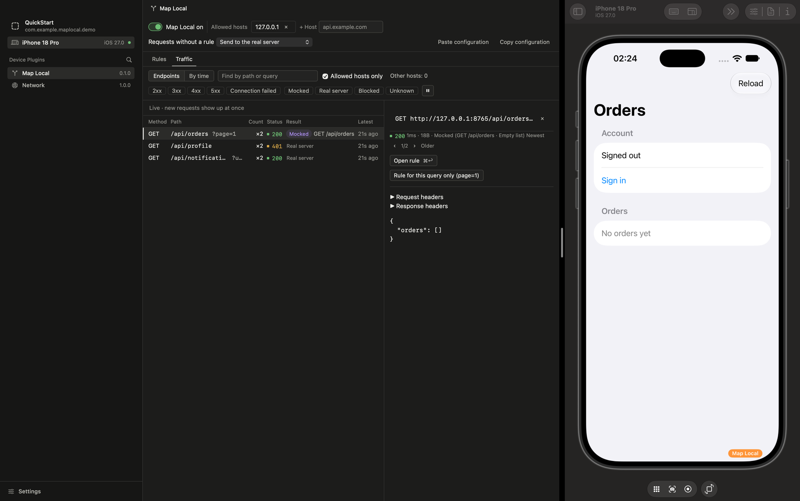

# Map Local for Necto

[English](README.md) | 한국어

[Necto](https://github.com/toss/necto) 패널에서 엔드포인트의 응답을 정하면, 앱은 다음
요청부터 그 응답을 받아요.



> ⚠️ **TestFlight·App Store로 배포한다면 먼저
> [배포 빌드에서 Map Local 빼기](docs/release-builds-ko.md)를 읽으세요.** NectoSDK를 링크한
> 빌드는 App Store Connect 검증에서 비공개 API 사용으로 거절돼요
> (실측: `_touchesEvent`, `_setHIDEvent:` 등 7개 셀렉터).

이럴 때 써요.

- 화면을 다른 데이터, 에러, 느린 응답, 끊긴 연결로 보고 싶을 때
- 아직 없는 API로 먼저 개발할 때
- 특정 페이지나 항목 하나만 다르게 응답하고 싶을 때
- 테스트 계정 없이 로그인을 목업할 때
- 내가 쓴 응답을 QA에게 그대로 넘길 때

[목적별 사용법](docs/recipes-ko.md)에 각각의 짧은 단계가 있어요. 알아 둘 점은 이래요.

- 프록시의 Map Local처럼 쓰지만 인증서·프록시 설정이 없고, SSL 피닝과 상관없이 동작해요.
  정하지 않은 요청은 실제 서버로 가요([docs/usage-ko.md](docs/usage-ko.md)).
- 규칙은 메서드, 호스트, `/users/{id}` 같은 경로 템플릿, 쿼리 조건으로 맞춰요. 응답을
  바꿔 가며 쓰고, 지연과 오류를 넣고, 규칙 없는 요청을 차단하거나 실패하게 할 수 있어요
  ([docs/usage-ko.md](docs/usage-ko.md)).
- 트래픽 탭은 앱이 보낸 요청과 그 요청에 무엇이 응답했는지 보여 줘요. 요청 하나를 한 번에
  규칙으로 만들고, Necto 네트워크 플러그인을 등록했다면 실제 응답으로 채워요
  ([docs/usage-ko.md](docs/usage-ko.md)).
- 무언가 적용되는 동안 앱에 배지가 보여요. 배지를 누르면 Map Local을 끌 수 있어요
  ([docs/usage-ko.md](docs/usage-ko.md)).
- Release 빌드에는 플러그인 코드가 하나도 컴파일되지 않고, `verify-release`가 CI에서 그것을
  증명해요([docs/release-builds-ko.md](docs/release-builds-ko.md)).
- 패널이 설정에 하는 일은 모두 `necto-cli`로도 할 수 있어요. 설정을 파일로 공유해요
  ([docs/cli-ko.md](docs/cli-ko.md)).

## 빠른 시작

사내·로컬 전용 앱 기준이에요. 먼저 [요구 사항](#요구-사항)을 확인하세요.

1. 패키지를 추가해요: `https://github.com/ryan-son/necto-map-local-plugin` (`0.1.0`부터)
2. 앱 시작 시점에 등록해요.
   ```swift
   #if DEBUG
   import NectoSDK
   import NectoMapLocalPlugin
   #endif

   // App.init 등 가장 이른 시점
   #if DEBUG
   NectoSDK.register(NectoMapLocalPlugin())
   NectoSDK.start()
   #endif
   ```
3. Necto 앱을 실행하고 기기 → 앱 → **Map Local**을 열어요.
4. 「트래픽」 탭에서 요청을 고르고 「이 응답으로 목업」을 눌러요. 목업하면 그 호스트도 허용
   호스트에 들어가요. 「규칙」 탭에서 응답을 고쳐요.

바꾸는 즉시 저장되고 다음 요청부터 적용돼요. Map Local이 켜져 있으면 Necto가 있든 없든
규칙이 적용돼요. 나머지는 [docs/usage-ko.md](docs/usage-ko.md)에 있어요.

### 요구 사항

- [Necto](https://github.com/toss/necto) 0.2.x(0.2.0 이상 0.3.0 미만). Mac 앱과 앱이
  링크하는 SDK 모두예요. 패키지는 `.upToNextMinor(from: "0.2.0")`을 선언해요. Necto의 새
  마이너에는 이 플러그인의 대응 릴리스가 필요해요.
- 앱은 iOS 17 이상. 엔진과 테스트는 macOS 14에서도 빌드돼요.
- Xcode 26 이상. 구성 이름 규칙과 배포 검사는 Xcode 26에서 실측했고, Xcode 27.1 베타에서도
  통과해요. CI는 Xcode 26에서 돌아요.
- Node 22.12 이상. 패널을 소스에서 빌드할 때만 필요해요.

## 알려진 한계

- 앱이 `NectoSDK.register`보다 먼저 만든 세션과 설정은 가로채지 않아요(`URLSession.shared`는
  가로채요). 앱 시작의 가장 이른 시점에 등록하세요.
- 일부 SDK처럼 `protocolClasses`를 통째로 바꾼 설정에서는 Map Local이 빠져요. 목록 맨 앞에
  `NectoMapLocalPlugin.protocolClass`를 다시 넣으세요.
- `URLSession` 위에 만든 라이브러리(예: Alamofire, Moya)도 같은 두 조건에서 동작해요.
- 백그라운드 세션과 `WKWebView`는 가로채지 않아요.
- 목업 3xx는 따라가지 않고 그대로 돌려줘요. 실제 리다이렉트의 목적지가 규칙과 맞으면 그
  홉은 목업돼요.
- 목업 응답의 `Set-Cookie`는 항상 `HTTPCookieStorage.shared`에 들어가요.

이유를 포함한 전체 목록은 [docs/usage-ko.md](docs/usage-ko.md)에 있어요.

## 문서

- [목적별 사용법](docs/recipes-ko.md): 자주 하는 일의 짧은 단계
- [사용법](docs/usage-ko.md): 매칭, 트래픽 탭, 호스트, 배지, 키보드, 문제 해결
- [배포 빌드](docs/release-builds-ko.md): Necto 빼기, 구성 이름 규칙, CI에서 막기
- [가져오기·내보내기와 CLI](docs/cli-ko.md): 파일 형식, 오퍼레이션, 오류
- 기여자 안내: [경험](docs/experience-ko.md) · [설계](docs/design-ko.md) ·
  [처음 쓰는 사람 테스트](docs/first-use-test-ko.md) · [검증 기록(영문)](docs/verification-log.md)
- [보안](SECURITY-ko.md) · [변경 기록(영문)](CHANGELOG.md)
- Necto 자체 안내: [github.com/toss/necto](https://github.com/toss/necto/tree/main/docs)

## 기여하기

누구든 기여를 환영해요. 소스에서 빌드하는 방법, 이슈 신고, 풀 리퀘스트는
[기여 안내](CONTRIBUTING-ko.md)([English](CONTRIBUTING.md))를 보세요.

## 라이선스

MIT. [LICENSE](LICENSE)를 보세요. 내장된 패널에는 서드파티 코드가 들어 있어요.
[THIRD_PARTY_NOTICES.txt](THIRD_PARTY_NOTICES.txt)를 보세요.
