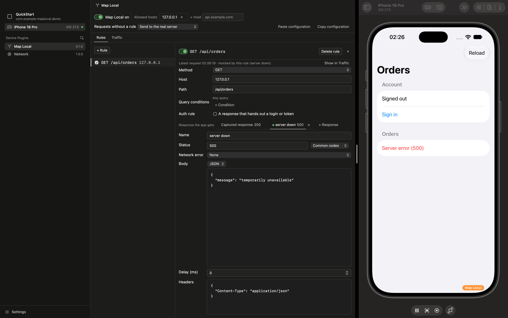
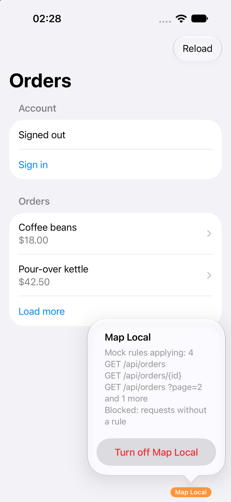

# Recipes

[한국어](recipes-ko.md)

Short paths for common jobs. Each one assumes the [Quick start](../README.md#quick-start)
is done: the app registers Map Local, and its panel is open in Necto. Labels are the
panel's English ones. [usage.md](usage.md) explains every control.

Most recipes end the same way: make the app send the request again (reload, or reopen the
screen). While Map Local is on, the app shows the `Map Local` badge whenever Map Local
is affecting it ([The badge](usage.md#the-badge)).

When you come back to Necto from the simulator, the first click only brings the Necto
window forward, in every Necto panel. Click again.

- [See a screen with different data](#see-a-screen-with-different-data)
- [Show an error screen](#show-an-error-screen)
- [Check a loading state](#check-a-loading-state)
- [Act as if the app were offline](#act-as-if-the-app-were-offline)
- [Build against an API that isn't ready](#build-against-an-api-that-isnt-ready)
- [Answer one query differently](#answer-one-query-differently)
- [Mock a login](#mock-a-login)
- [Share a configuration](#share-a-configuration)
- [Find out why a request wasn't mocked](#find-out-why-a-request-wasnt-mocked)
- [Stop mocking](#stop-mocking)

## See a screen with different data

Use this for an empty list, a long name, or a case the server rarely returns.

1. In the "Traffic" tab, select the request behind the screen.
2. Press "Mock with this response" (⌘↩). The new rule starts with the response the app
   just got. Mocking also adds the request's host to the allowed hosts if it isn't there.
3. Press "Open rule", and edit the body. It saves as you type.
4. Request again in the app.

Under the rule's name, a line shows the newest request that matches the rule and what
answered it. After your change, it reads "mocked by this rule", and the app shows your
data, so you can confirm the change without leaving the editor. If that request came before
your last change, the line adds "from before the last change", so you don't take an old
answer for the new one. "Show in Traffic" opens that request in the "Traffic" tab.

To see real responses in the "Traffic" tab, register Necto's network plugin
([Capturing real responses](usage.md#capturing-real-responses)). Without it, the button in
step 2 is "Mock with an empty response", and the rule starts with an empty 200 JSON body.

## Show an error screen

1. Open the request's rule: "Open rule" in the traffic detail, or the rule in the "Rules"
   tab. If there is none, make one first with the recipe above.
2. Press "+ Response". The new response appears next to the first one, and the app gets it
   from now on.
3. Set "Status" to the code your app handles, such as 500 or 401, and the body it expects.
   "Common codes" beside the field lists the usual ones. "Name" renames the response, for
   example to "server down". The name is saved when you press Return or leave the field.
4. Request again in the app.

Each response tab says what its response is, such as "200", "500" or "No internet
connection", so you can tell the normal and the error response apart at a glance.

Select a response tab under "Response the app gets" to change what the app gets. Select the
first tab to go back. Keep both responses, and you can switch between the normal and the error
screen with one click. The × on a response tab deletes that response without first making
it the one the app gets. The × shows on the tab you're viewing and on any tab under the
pointer. "Undo" brings the response back.

## Check a loading state

Set "Delay (ms)" on the response the app gets, for example `3000`. The app waits that long
for it, so the loading indicator stays on screen.

## Act as if the app were offline

To make every request to the allowed hosts fail, set "Requests without a rule" to "No
internet connection (-1009)", and turn off the rules whose requests should fail too.
Requests to allowed hosts that no rule answers then fail with that `URLError`. Rules that
are on still answer their requests. The same setting also offers "Connection lost (-1005)"
and "Timed out (-1001)".

To fail only the requests that one rule answers, set "Network error" on that rule's
response the app gets instead. The app gets the error regardless of the status. Set it back
to "None" to return to the response.

Map Local fails requests. It does not change what the device reports about its network, so
`NWPathMonitor` still says the device is connected. If your app decides its offline state
from `NWPathMonitor`, take the device offline instead: use airplane mode or the Network Link
Conditioner (Settings › Developer on a device).

## Build against an API that isn't ready

1. Press "+ Rule". The new rule starts as `GET /` and off. It turns on when you change its
   path, so a half-made rule never answers anything.
2. Choose the method and write the path. A segment like `{id}` matches any one non-empty
   segment, so `/api/orders/{id}` answers `/api/orders/1001` and `/api/orders/1002`.
3. Leave "Host" empty to answer every allowed host, or name one.
4. Write the response you agreed on with the server team: "Status" and "Body".
5. Make sure the host is in "Allowed hosts" (the "+ Host" field in the header).

When the real API ships, turn the rule off, and the app's requests go to the real server
again.

## Answer one query differently

Use this to empty page 2 while page 1 stays as it is, or to make one item fail.

1. In the "Traffic" tab, select the request with that query, such as `?page=2`.
2. If no rule answers it yet, check "Only with this query" and press "Mock with this
   response". If a rule that doesn't check every key of the query
   already mocked this request, press "Rule for this query only (page=2)" instead. If the
   request reached the real server before that rule existed, make the app send it again
   first. The new rule starts with the response the app gets now.
3. Open the rule, and edit the response.

Every key of the request's query becomes a condition. A key may change on every request,
such as a cache buster `_=1696500000`. Then the new rule doesn't answer the next request,
and that request's traffic detail says which condition failed, with "Remove the _
condition" beside it. The panel watches the new rule only until it first answers. After
that, a page 3 request gets no such note about the page 2 rule.

You can also make one by hand: "+ Rule" with the same method and path, then "+ Condition"
under "Query conditions" with the key and value, such as `page` and `2`.

When several rules match, the one with more query conditions answers. So the new rule
answers `?page=2`, and the first rule keeps answering every other page
([When several rules match](usage.md#when-several-rules-match)). Each rule's editor says
so under its query conditions, and the traffic detail names the rule that took precedence.

## Mock a login

1. Make a rule for the login or token request, and turn on "Auth rule". Give it the status
   and body of a successful login.
2. Set "Requests without a rule" to "Block (421)". Requests to allowed hosts that no rule
   answers then get 421 instead of carrying the mocked token to the real server, where they
   would fail with 401 and could log the app out. Requests to other hosts still go to the
   real server.
3. Log in, and mock the requests the app sends next. Each one that still gets 421 shows as
   "Blocked" in the "Traffic" tab.

While the auth rule answers, the badge reads `Map Local 🔑`, and the panel says a
[mocked session](usage.md#auth-rule) may remain. **When you're done, log out in the app
first**, then press "I've logged out" in the panel. If you turn the rule or Map Local off
before that, Map Local asks you to log out first.

## Share a configuration

To hand a teammate or QA the exact responses you used:

1. Press "Copy configuration". A window opens with the text selected. Press "Copy" or ⌘C.
   If the configuration holds values that look like tokens, as it does with an auth rule,
   the panel shows a one-line warning. Check those values before you share the text.
2. Send the text. The other person presses "Paste configuration" and pastes it. A line
   under the text says how many rules and which hosts it holds, and that it replaces their
   current configuration. Then they press "Import".

The import replaces the whole configuration: whether Map Local is on, the allowed hosts,
the "Requests without a rule" setting and every rule. Importing a file exported while Map
Local was on turns it on. From a terminal or a script, `necto-cli` does the same ([cli.md](cli.md)).

## Find out why a request wasn't mocked

Select the request in the "Traffic" tab. When a rule matches a request that was not mocked,
the traffic detail says why in one line, with the fix beside it.
[Why a request wasn't mocked](troubleshooting.md#why-a-request-wasnt-mocked) lists every
reason with its fix, and what to check when no rule matches at all.

## Stop mocking

- From the panel: turn off the "Map Local on" switch in the header.
- From the app: tap the `Map Local` badge, then "Turn off Map Local". The panel follows.

Rules stay as they are, ready for next time. To turn Map Local back on, use the panel or
`necto-cli` ([necto-cli operations](cli.md#necto-cli-operations)). The app can't do it.
