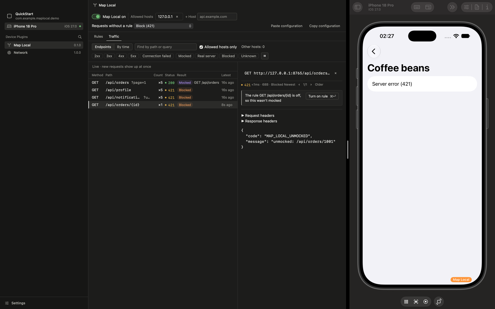

# Troubleshooting

[한국어](troubleshooting-ko.md)

Find your symptom in the table and follow the check beside it. What each part of the panel
does is in [usage.md](usage.md).

## Find your symptom

| Symptom | Check |
| --- | --- |
| A rule doesn't match | Is the host in the allowed hosts, and not a host blocked in app code (`blockedHosts`)? In the "Traffic" tab, is the request's result "Real server"? Requests to hosts that aren't allowed are hidden while "Allowed hosts only" is on; press "Other hosts" to show them, dimmed. Then see [Why a request wasn't mocked](#why-a-request-wasnt-mocked) |
| The panel shows "Waiting for the app to connect…" | Is the app running as a Debug build, and did you select that app in Necto? |
| `module<NectoMapLocalPlugin>` compile error | Follow the [build configuration name rule](release-builds.md#follow-the-build-configuration-name-rule) |
| Requests to an allowed host get 421 | "Requests without a rule" is set to "Block (421)". Add the rules you need, or set it to "Send to the real server" |
| Requests to an allowed host fail as if offline (-1009, -1005 or -1001) | "Requests without a rule" is set to an error. Add the rules you need, or set it to "Send to the real server" |
| The traffic detail says a matching rule didn't mock a request | Follow its one-line reason. Each reason and its fix are in [Why a request wasn't mocked](#why-a-request-wasnt-mocked) |
| The app doesn't appear in Necto | Several builds of one app (for example a Dev and a production flavor) can be installed at the same time. Launch the build whose code registers the plugin |
| Requests from a fresh install reach the production server | The app's own default may point to the production server until you switch its server environment. `blockedHosts` keeps the production server from being mocked, but still lets those requests through |

## Why a request wasn't mocked

Select the request in the "Traffic" tab. When a rule matches a request that was not mocked,
the traffic detail says why in one line, with the fix beside it:

| The detail says | Fix |
| --- | --- |
| Map Local is off | "Turn on" |
| The host isn't an allowed host | "Add to allowed hosts" |
| The rule is off | "Turn on rule" |
| The app code blocks this host | Nothing in the panel: the app's `blockedHosts` keeps it from being mocked |
| The rule applies now | Request again in the app |
| A rule just made from traffic didn't answer. Rule: `_=100` · This request: `_=200` | "Remove the _ condition", offered when removing it makes the rule answer this request |

When no rule matches at all, compare the method, path and query with the rule you expected.
What a rule must match is in [Matching rules](usage.md#matching-rules). A dimmed host in the
row means it is not an allowed host; such rows show only after "Other hosts" or with
"Allowed hosts only" off.
